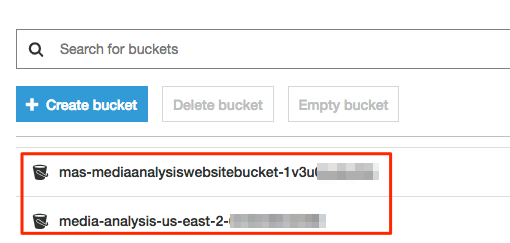

# Build Searchable Media Library and Moderate Content at Scale Using Machine Learning

Companies have to process, analyze, and extract meaning from ever-growing volumes of audio, image, and video data. Automating media workflows, such as image and video indexing or manual content moderation, can help you scale the growth of your media library and save time from manual, error-prone work. In this workshop, you will learn how to automate workflows using the Media Analysis Solution, which includes Amazon Rekognition, Amazon Transcribe, and Amazon Comprehend. You will learn how to extract metadata from media files, create a searchable library of metadata, and moderate audio and visual content at scale.

In this workshop, we will use following AWS services:

* Amazon Rekognition
* Amazon Transcribe
* Amazon Comprehend
* AWS Lambda
* AWS Step Functions
* Amazon Elasticsearch
* Amazon S3
* Amazon API Gateway

## Architecture

## Learning Objectives

* Deploy the Media Analysis Solution using AWS CloudFormation (https://aws.amazon.com/cloudformation/). The AWS CloudFormation templates automatically launch and configure the necessary components.
* Use managed AWS AI/ML services to extract metadata from your media files, and store the resulting metadata for future search and analysis.
* Extend Media Analysis Solution to detect and filter inappropriate content.

## Pre-requisites

### AWS Account

In order to complete this workshop you'll need an AWS Account with access to create AWS IAM, Amazon S3, AWS Lambda, AWS Step Functions, Amazon API Gateway and Amazon Elasticsearch cluster; and access to invoke Amazon Rekognition, and Amazon Transcribe. All of the resources you will launch as part of this workshop are eligible for the AWS free tier if your account is less than 12 months old. See the [AWS Free Tier page](https://aws.amazon.com/free/) for more details.

## Modules

This workshop is broken up into following modules:

1. [Setup Media Analysis Solution](1-MediaAnalysisSolution)
2. [Extend Media Analysis Solution for Content Moderation](2-ContentModeration)

## Clean up

1. Go to the CloudFormation console https://console.aws.amazon.com/cloudformation/home

2. Select stack with Stack Name - `Media Analysis`, click Actions and click on Delete Stack. This will also delete all the nested stacks.

  

3. Delete S3 buckets created by Media Analysis Solution.

  
